# 📢 CRUD 제작

## 목표

<aside>
💡 REST API를 이해하고 이를 활용하여 CRUD 게시판을 제작할 수 있다.

</aside>

## 개요
- 프로젝트 빌드
- 게시글 작성 기능 구현
- 게시글 출력 기능 구현
- 게시글 리스트 출력 기능 구현
- 게시글 수정 기능 구현
- 게시글 삭제 기능 구현
- 게시글 댓글 기능 구현
- 페이징 기능 구현
- DOCKER 배포

## 프로젝트 빌드

### 1. 프로젝트 생성

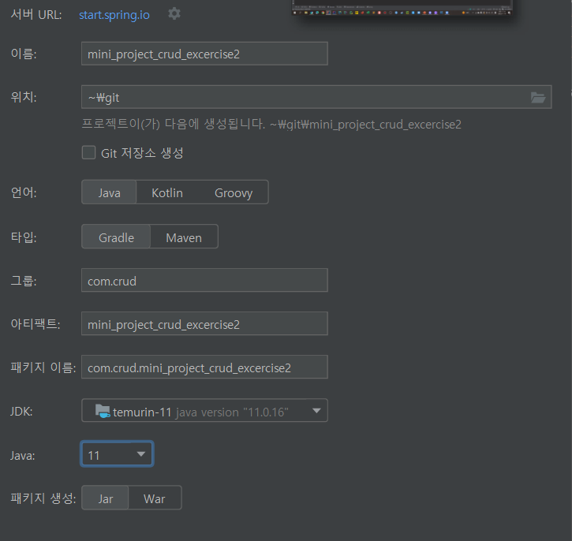
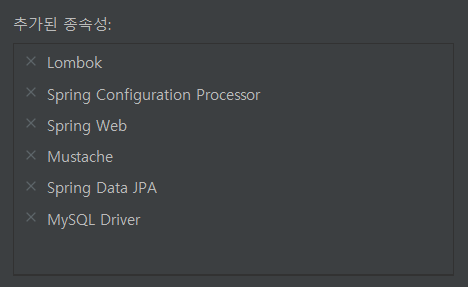

### 2. yml 파일 설정

```yaml
#server 포트 지정, 인코딩 설정
server:
  port: 8082
  servlet:
    encoding:
      force-response: true

#jpa datasource 설정
spring:
  datasource:
    driver-class-name: com.mysql.cj.jdbc.Driver
    url: ${DB_HOST}
    username: ${DB_USER}
    password: ${DB_PASSWORD}
    
#jpa DB 설정
#ddl-auto 설정 시 주의해야할 사항은 한번 실행 후 create를 vaidate나 update로 변경
#create 설정은 재실행시 table 삭제후 다시 재생성하므로 데이터가 날라간다.
  jpa:
    show-sql: true
    database-platform: org.hibernate.dialect.MySQL8Dialect
    database: mysql
    hibernate:
      ddl-auto: create
```

- `show-sql: true` - 잘 실행됐는지 미리 알 수 있다.
- `ddl-auto: create` - 주의하여 사용, 처음에만 create 사용하고 다음부터는 validate나 update

### 3. 환경변수 설정

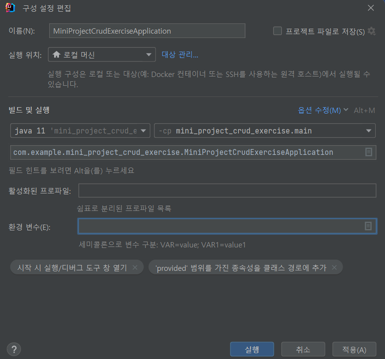
환경변수 추가해줘야 한다.

- 환경변수 추가
    - `DB_HOST`
    - `DB_USER`
    - `DB_PASSWORD`

## 게시글 작성 기능 구현

### 0. 구현 후 모습

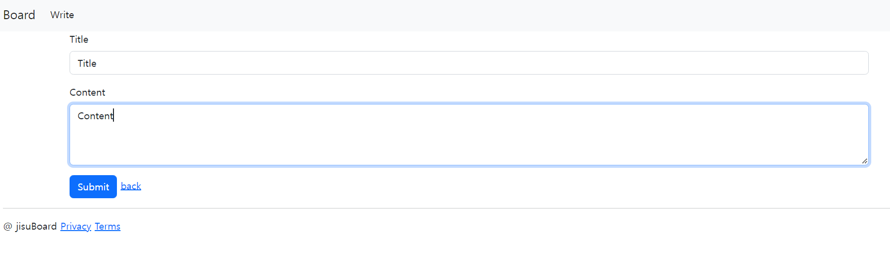

### 1. 게시글 작성 view 구현

<aside>
💡 view는 부트스트랩과 mustache로 구현했다.
부트스트랩 : [https://getbootstrap.com/](https://getbootstrap.com/)

</aside>

- header.mustache_네비게이션 바 추가

```html
<!doctype html>
<html lang="en">
<head>
    <meta charset="utf-8">
    <meta name="viewport" content="width=device-width, initial-scale=1">
    <title>Bootstrap demo</title>
    <link href="https://cdn.jsdelivr.net/npm/bootstrap@5.2.2/dist/css/bootstrap.min.css" rel="stylesheet" integrity="sha384-Zenh87qX5JnK2Jl0vWa8Ck2rdkQ2Bzep5IDxbcnCeuOxjzrPF/et3URy9Bv1WTRi" crossorigin="anonymous">
</head>
<body>
<nav class="navbar navbar-expand-lg bg-light">
    <div class="container-fluid">
        <a class="navbar-brand" href="#">Board</a>
        <button class="navbar-toggler" type="button" data-bs-toggle="collapse" data-bs-target="#navbarSupportedContent" aria-controls="navbarSupportedContent" aria-expanded="false" aria-label="Toggle navigation">
            <span class="navbar-toggler-icon"></span>
        </button>
        <div class="collapse navbar-collapse" id="navbarSupportedContent">
            <ul class="navbar-nav me-auto mb-2 mb-lg-0">
                <li class="nav-item">
                    <a class="nav-link active" aria-current="page" href="#">Write</a>
                </li>
            </ul>
        </div>
    </div>
</nav>
```

- footer.mustache

```html
<div class="mb-5 container-fluid">
    <hr>
    <p>@ jisuBoard <a href="#">Privacy</a> <a href="#">Terms</a></p>
</div>
<script src="https://cdn.jsdelivr.net/npm/bootstrap@5.2.2/dist/js/bootstrap.bundle.min.js" integrity="sha384-OERcA2EqjJCMA+/3y+gxIOqMEjwtxJY7qPCqsdltbNJuaOe923+mo//f6V8Qbsw3" crossorigin="anonymous"></script>
</body>
</html>
```

- write.mustache_title 작성란, content 작성란, 제출버튼으로 구성

```html
{{>layouts/header}}
<form class="container" action = "/board/post" method="post">
    <div class="mb-3">
        <label class="form-label">Title</label>
        <input class="form-control" name="title">
    </div>
    <div class="mb-3">
        <label class="form-label">Content</label>
        <textarea class="form-control" name="content" style="height: 100px"></textarea>
    </div>
    <button type="submit" class="btn btn-primary">Submit</button>
</form>
{{>layouts/footer}}
```

### 2. view에서 controller로 데이터를 전달할 DTO 클래스 구현

```java
package com.example.mini_project_crud_exercise.domian.dto;

import com.example.mini_project_crud_exercise.domian.entity.Article;
import lombok.AllArgsConstructor;
import lombok.Getter;
import lombok.ToString;

@Getter
@AllArgsConstructor
@ToString
public class ArticleDto {
    private String title;
    private String content;

    public Article toEntity(){
        return new Article(this.title, this.content);
    }
}
```

- DTO는 계층 간 데이터 교환이 이루어질 수 있도록 도와주는 객체이다.
- view에서 controller로 데이터를 전달할 때 사용한다.

### 3. controller에서 DB로 data를 전달할 Entity 클래스 구현

```java
package com.example.mini_project_crud_exercise.domian.entity;

import com.example.mini_project_crud_exercise.repository.ArticleRepository;
import lombok.AllArgsConstructor;
import lombok.Getter;
import lombok.NoArgsConstructor;

import javax.persistence.*;

@Entity
@Table(name = "board")
@NoArgsConstructor
@Getter
public class Article {
    @Id
    @GeneratedValue(strategy = GenerationType.IDENTITY)
    private Long id;

    private String title;
    private String content;

    public Article(String title, String content) {
        this.title = title;
        this.content = content;
    }
}
```

- 주요 어노테이션
    - `@Entity` : JPA에서 DB에서 다룰 정보를 객체로 관리한다.
    - `@Table` : DB의 어떤 TABLE과 mapping할 것인지 정한다.
    - `@Id` : Entity 어노테이션을 사용하면 반드시 추가해야 하는 어노테이션이고, 해당 어노테이션을 추가한 변수는 Primary Key를 의미한다.
    - `@GeneratedValue(strategy = GenerationType.IDENTITY)`
        - DB에서 자동으로 Id를 생성할 수 있도록 기본 키 생성을 위임한다.
        - strategy에 따라서 설정을 달리 할 수 있다.
        - 참고 링크 : [https://gmlwjd9405.github.io/2019/08/12/primary-key-mapping.html](https://gmlwjd9405.github.io/2019/08/12/primary-key-mapping.html)

### 4. Entity와 DB의 상호작용을 할 수 있는 인터페이스 구현

```java
package com.example.mini_project_crud_exercise.repository;

import com.example.mini_project_crud_exercise.domian.entity.Article;
import org.springframework.data.jpa.repository.JpaRepository;

public interface ArticleRepository extends JpaRepository<Article, Long> {
}
```

- JPA를 사용할 수 있는 JpaRepository를 상속을 받는다.

### 5. 게시글 작성 API를 구현_Controller 클래스

```java
package com.example.mini_project_crud_exercise.controller;

import com.example.mini_project_crud_exercise.domian.dto.ArticleDto;
import com.example.mini_project_crud_exercise.domian.entity.Article;
import com.example.mini_project_crud_exercise.repository.ArticleRepository;
import lombok.extern.slf4j.Slf4j;
import org.springframework.stereotype.Controller;
import org.springframework.web.bind.annotation.GetMapping;
import org.springframework.web.bind.annotation.PostMapping;
import org.springframework.web.bind.annotation.RequestMapping;

@Controller
@RequestMapping("/board")
@Slf4j
public class BoardController {

    private final ArticleRepository articleRepository;

    public BoardController(ArticleRepository articleRepository) {
        this.articleRepository = articleRepository;
    }

    @GetMapping("/new")
    public String writeArticleForm(){
        return "write";
    }

    @PostMapping("/post")
    public String saveArticle(ArticleDto articleDto){
        log.info(articleDto.toString());
        Article article = articleDto.toEntity();
        articleRepository.save(article);
        return "";
    }
}
```

- `articleRepository`
    - 스프링 부트가 articleRepository의 구현체를 생성하여 의존관계를 맺어준다.
    - 따라서 직접 articleRepository의 구현체를 생성하지 않아도 JpaRepository의 기능을 사용할 수 있다.
- `writeArticleForm`
    - GET REST API로 매핑된 url로 이동하면 위에서 구현한 write 템플릿의 이름을 반환한다.
- `saveArticle`
    - write 템플릿에서 제출버튼을 클릭하면 form에서 작성한 데이터는 post방식으로 해당 url로 매핑된 메서드로 이동한다.
    - POST REST API로 매핑된 메서드에서 dto를 entity로 변환하여 entity를 save 메서드로 db에 insert한다.

<aside>
❗ **굳이 DTO를 ENTITY로 변환하여 사용하는 이유**

view의 form 데이터 형식은 변경될 가능성이 높다. 따라서 DTO를 변경할 상황이 많아질 수도 있다.

DTO를 ENTITY대신 사용한다면 변경된 form에 따라 DB에 접근할 데이터도 형식이 달라질 수 있다.(ex. title, content 뿐만이 아니라 email 작성란도 추가되는 상황)
DB의 데이터 형식은 테이블이 변경되지 않는 한 고정되어있기 때문에 DB에 접근하는 데이터 형식이 달라지면 문제가 생긴다.

결론적으로 위와 같은 문제를 겪지 않기 위해 DTO와 ENTITY를 사용하여 DTO로 view에서 controller로 데이터를 받고 해당 데이터를 DB형식에 맞도록 ENTITY로 변환하여 DB에 접근한다.

</aside>

## 게시글 출력 기능 구현

### 0. 구현 후 모습

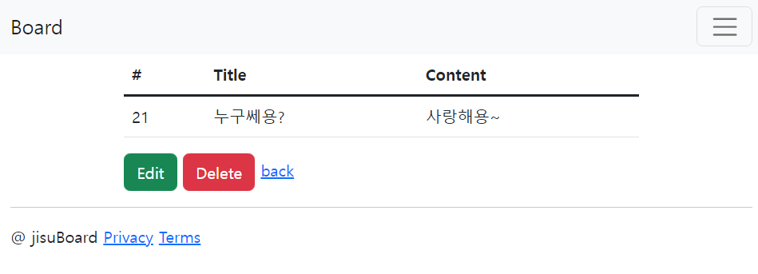

### 1. 게시글 출력 view 구현

- error.mustache_게시글이 없을 경우 출력할 view

```html
{{>layouts/header}}
<div>error</div>
{{>layouts/footer}}
```

- show.mustache_table 형태로 1개의 게시글을 출력

```html
{{>layouts/header}}
<table class="table">
    <thead>
    <tr>
        <th scope="col">#</th>
        <th scope="col">Title</th>
        <th scope="col">Content</th>
    </tr>
    </thead>
    <tbody class="table-group-divider">
    {{#article}}
    <tr>
        <td>{{id}}</td>
        <td>{{title}}</td>
        <td>{{content}}</td>
    </tr>
    {{/article}}
    </tbody>
</table>
{{>layouts/footer}}
```

### 2. 게시글을 출력하는 API 메소드_Controller 클래스의 일부

```java
		@GetMapping("/{id}")
    public String showArticle(@PathVariable Long id, Model model) {
        Optional<Article> optArticle = articleRepository.findById(id);
        if (optArticle.isEmpty())
            return "error";
        else {
            model.addAttribute("article", optArticle.get());
            return "show";
        }
    }
```

- `showArticle`
    - url에 있는 id를 `@PathVariable` 로 받는다.
    - findById로 DB에서 해당 Id를 가지고 있는 row 데이터를 받아온다.
    - if문으로 데이터가 있는지 없는지 체크한다.
        - 있으면 model 객체를 활용하여 view의 article변수에 해당 Article객체를 넘기고, show  템플릿의 이름을 반환한다.
        - 없으면 error 템플릿의 이름을 반환한다.

## 게시글 리스트 출력 기능 구현

### 0. 구현 후 모습

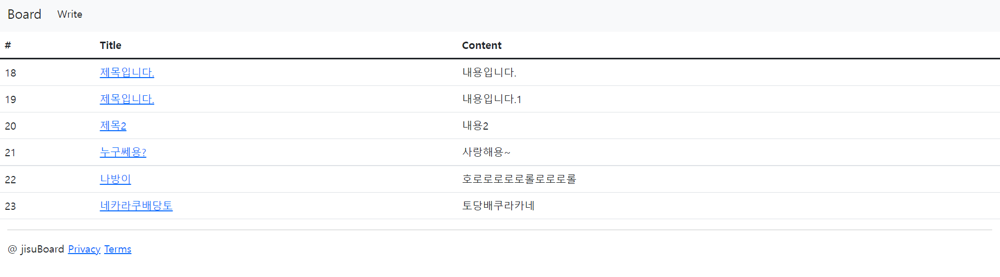

### 1. 게시글 리스트 출력 view 구현

- list.mustache_table형식으로 리스트를 출력, title을 클릭하면 show로 게시글 출력

```html
{{>layouts/header}}
<table class="table">
    <thead>
    <tr>
        <th scope="col">#</th>
        <th scope="col">Title</th>
        <th scope="col">Content</th>
    </tr>
    </thead>
    <tbody class="table-group-divider">
    {{#articles}}
    <tr>
        <td>{{id}}</td>
        td><a href="/board/{{id}}">{{title}}</a></td>
        <td>{{content}}</td>
    </tr>
    {{/articles}}
    </tbody>
</table>
{{>layouts/footer}}
```

### 2. 게시글 리스트를 출력하는 API 구현_Controller 클래스

```java
    @GetMapping("")
    public String listArticle(Model model){
        List<Article> list = articleRepository.findAll();
        model.addAttribute("articles",list);
        return "list";
    }
```

- `listArticle`
    - findAll로 테이블에 있는 모든 데이터를 리스트 형식으로 반환한다.
    - model 객체로 view의 articles 변수에 list를 전달한다.
    - list 템플릿의 이름을 반환한다.

## 게시글 수정 기능 구현

### 0. 구현 후 모습

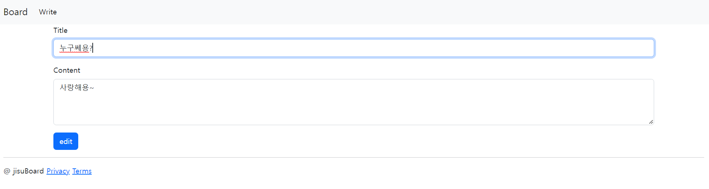

21번 게시물의 수정버튼을 누른 후 화면

### 1. 게시글 수정 기능 view 구현

- show.mustache_table태그 아래 버튼 추가

```java
<a href = "/board/{{id}}/edit" class="btn btn-success">Edit</a>
<a href = "/board">back</a>
```

- edit.mustache_id값은 hidden으로 처리한다.

```html
{{>layouts/header}}
{{#article}}
<form class="container" action = "/board/{{id}}/upadate" method="post">
    <input type="hidden" name="id" value="{{id}}">
    <div class="mb-3">
        <label class="form-label">Title</label>
        <input class="form-control" name="title" value={{title}}>
    </div>
    <div class="mb-3">
        <label class="form-label">Content</label>
        <textarea class="form-control" name="content" style="height: 100px">{{content}}</textarea>
    </div>
    <button type="submit" class="btn btn-primary">edit</button>
</form>
{{/article}}
{{>layouts/footer}}
```

### 2. view에서 Controller로 data를 전달할 DTO 클래스 수정

```java
package com.example.mini_project_crud_exercise.domian.dto;

import com.example.mini_project_crud_exercise.domian.entity.Article;
import lombok.AllArgsConstructor;
import lombok.Getter;
import lombok.ToString;

@Getter
@AllArgsConstructor
@ToString
public class ArticleDto {

    private Long id;
    private String title;
    private String content;

    public Article toEntity(){
        return new Article( this.id, this.title, this.content);
    }
}
```

- Id가 있어야 수정할 게시글의 id를 넘겨줄 수 있다.
- Article 생성자의 매개변수에 id값을 넘겨준다.
    - Entity의 id값을 통해서 DB에 update를 할 수 있다.

### 3. Controller에서 DB로 데이터를 전달할 Entity 클래스 수정

```java
package com.example.mini_project_crud_exercise.domian.entity;

import com.example.mini_project_crud_exercise.repository.ArticleRepository;
import lombok.AllArgsConstructor;
import lombok.Getter;
import lombok.NoArgsConstructor;

import javax.persistence.*;

@Entity
@Table(name = "board")
@NoArgsConstructor
@AllArgsConstructor
@Getter
public class Article {
    @Id
    @GeneratedValue(strategy = GenerationType.IDENTITY)
    private Long id;

    private String title;
    private String content;
}
```

- DTO 클래스에서 넘겨주는 id값을 받아오기 위해 `@AllArgsConstructor` 어노테이션을 추가하여 모든 필드값을 초기화 해주는 생성자를 추가한다.

### 4. 게시글 수정 API를 구현_Controller 클래스

```java
		@GetMapping("/{id}/edit")
    public String editArticleForm(@PathVariable Long id, Model model){
        Optional<Article> optArticle = articleRepository.findById(id);
        if (optArticle.isEmpty())
            return "error";
        else {
            model.addAttribute("article", optArticle.get());
            return "edit";
        }
    }
```

- `editArticleForm`
    - show에서 수정 버튼을 클릭하면 해당 게시물의 id를 받아온다.
    - id를 넘긴 findById를 통해 해당 게시물의 데이터를 가져온다
        - 데이터가 존재한다면 edit 템플릿의 article 변수에 데이터를 넘겨준다.
        - edit 템플릿의 이름을 리턴한다.
    - 데이터가 없으면 error 템플릿의 이름을 리턴한다.

```java
@PostMapping("/{id}/upadate")
    public String updateArticle(ArticleDto articleDto) {
        log.info(articleDto.toString());
        Article article = articleDto.toEntity();
        articleRepository.save(article);
        return "redirect:/board/" + article.getId();
    }
```

- `updateArticle`
    - edit 페이지에서 수정 버튼을 누르면 해당 API로 이동한다.
    - edit 페이지에서 수정한 데이터를 DTO객체로 받는다.
    - DTO객체를 ENTITY로 변환한다.
    - ENTITY를 save 메서드에 넘겨줘 update를 한다.
        - save 메서드는 primary key 가 존재하지 않을 경우 insert한다.
        - 있는 경우는 update를 한다.
    - 리다이렉트를 사용하여 수정된 게시물 출력 페이지의 url을 반환한다.

## 게시글 삭제 기능 구현

### 0. 구현 후 모습

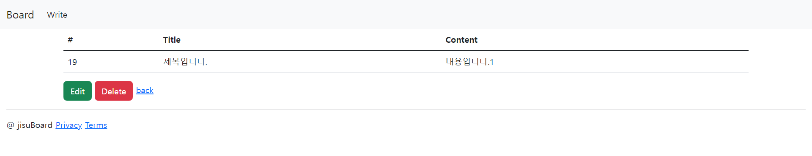
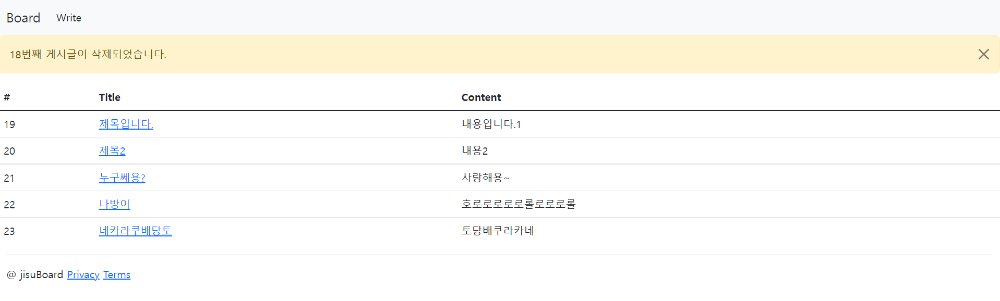

### 1. 게시글 삭제 기능 view 구현

- show.mustache_삭제버튼 추가

```html
{{>layouts/header}}
<div class="container">
<table class="table">
    <thead>
    <tr>
        <th scope="col">#</th>
        <th scope="col">Title</th>
        <th scope="col">Content</th>
    </tr>
    </thead>
    <tbody class="table-group-divider">
    {{#article}}
    <tr>
        <td>{{id}}</td>
        <td>{{title}}</td>
        <td>{{content}}</td>
    </tr>
    {{/article}}
    </tbody>
</table>
    <a href = "/board/{{id}}/edit" class="btn btn-success">Edit</a>
    <a href = "/board/{{id}}/delete" class="btn btn-danger">Delete</a>
    <a href = "/board">back</a>
</div>

{{>layouts/footer}}
```

- list.mustache_삭제시 뜨는 알림창 추가

```html
{{>layouts/header}}
{{#msg}}
    <div class="alert alert-warning alert-dismissible fade show" role="alert">
        {{msg}}
        <button type="button" class="btn-close" data-bs-dismiss="alert" aria-label="Close"></button>
    </div>
{{/msg}}
<table class="table">
    <thead>
    <tr>
        <th scope="col">#</th>
        <th scope="col">Title</th>
        <th scope="col">Content</th>
    </tr>
    </thead>
    <tbody class="table-group-divider">
    {{#articles}}
    <tr>
        <td>{{id}}</td>
        <td><a href="/board/{{id}}">{{title}}</a></td>
        <td>{{content}}</td>
    </tr>
    {{/articles}}
    </tbody>
</table>
{{>layouts/footer}}
```

### 2. 게시글 삭제 API 구현_Controller 클래스

```java
@GetMapping("/{id}/delete")
    public String deleteArticle(@PathVariable Long id, RedirectAttributes rtts) {
        Optional<Article> optArticle = articleRepository.findById(id);
        if (optArticle.isEmpty())
            return "error";
        else {
            articleRepository.deleteById(optArticle.get().getId());
            rtts.addFlashAttribute("msg",optArticle.get().getId()+"번째 게시글이 삭제되었습니다.");
            return "redirect:/board";
        }
    }
```

- `deleteArticle`
    - PathVariable로 id값을 받아 해당 아이디의 데이터를 받아온다.
    - 데이터의 존재 여부를 확인한다.
        - 데이터가 있으면 /board로 리다이렉트한다.
        - 데이터가 없으면 error 템플릿의 이름을 반환한다.

## 게시글 댓글 기능 구현

### 0. 구현 후 모습

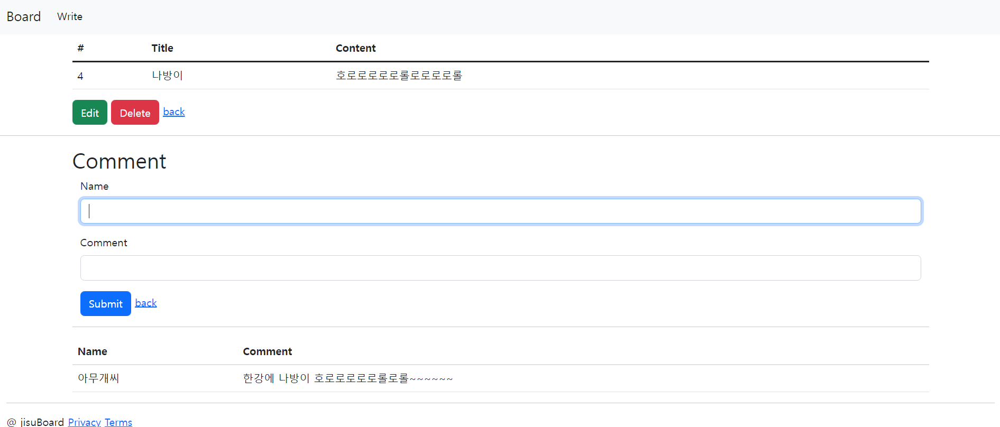

### 1. 게시글 댓글 view 구현

- show.mustache_댓글 작성폼, 댓글 리스트 테이블 추가

```html
{{>layouts/header}}
<div class="container">
<table class="table">
    <thead>
    <tr>
        <th scope="col">#</th>
        <th scope="col">Title</th>
        <th scope="col">Content</th>
    </tr>
    </thead>
    <tbody class="table-group-divider">
    {{#article}}
    <tr>
        <td>{{id}}</td>
        <td>{{title}}</td>
        <td>{{content}}</td>
    </tr>
    {{/article}}
    </tbody>
</table>
    <a href = "/board/{{id}}/edit" class="btn btn-success">Edit</a>
    <a href = "/board/{{id}}/delete" class="btn btn-danger">Delete</a>
    <a href = "/board">back</a>
</div>
<hr>
<!-- comment -->
<div class="container">
    <h2>Comment</h2>
    <form class="container" action = "/board/comment/post" method="post">
        <input type="hidden" name="articleId" value={{id}}>
        <div class="mb-3">
            <label class="form-label">Name</label>
            <input class="form-control" name="name">
        </div>
        <div class="mb-3">
            <label class="form-label">Comment</label>
            <input class="form-control" name="comment">
        </div>
        <button type="submit" class="btn btn-primary">Submit</button>
        <a href="/board" >back</a>
    </form>
    <hr>
    <table class="table">
        <thead>
        <tr>
            <th scope="col">Name</th>
            <th scope="col">Comment</th>
        </tr>
        </thead>
        <tbody class="table">
        {{#comments}}
            <tr>
                <td>{{name}}</td>
                <td>{{comment}}</td>
            </tr>
        {{/comments}}
        </tbody>
    </table>
</div>
{{>layouts/footer}}
```

### 2. view에서 controller로 데이터를 전달할 DTO 구현

```java
package com.example.mini_project_crud_exercise.domian.dto;

import com.example.mini_project_crud_exercise.domian.entity.Comment;
import lombok.AllArgsConstructor;
import lombok.Getter;
import lombok.Setter;
import lombok.ToString;

@Getter
@ToString
@AllArgsConstructor
public class CommentDto {

    private Long articleId;
    private String name;
    private String comment;

    public Comment toEntity(){
        return new Comment(this.articleId,this.name,this.comment);
    }
}
```

### 3. controller에서 DB로 데이터를 전달할 Entity 구현

```java
package com.example.mini_project_crud_exercise.domian.entity;

import lombok.AllArgsConstructor;
import lombok.NoArgsConstructor;

import javax.persistence.*;

@Entity
@Table(name = "comment")
@AllArgsConstructor
@NoArgsConstructor
public class Comment {
    @Id
    @GeneratedValue(strategy = GenerationType.IDENTITY)
    private Long id;

    private Long articleId;
    private String name;
    private String comment;

    public Comment(Long articleId, String name, String comment){
        this.articleId = articleId;
        this.name = name;
        this.comment = comment;
    }
}
```

### 4. Entity와 DB 상호작용을 할 수 있는 JPA 인터페이스 구현

```java
package com.example.mini_project_crud_exercise.repository;

import com.example.mini_project_crud_exercise.domian.entity.Comment;
import org.springframework.data.jpa.repository.JpaRepository;

import javax.transaction.Transactional;
import java.util.List;

public interface CommentRepository extends JpaRepository<Comment,Long> {
    List<Comment> findByArticleId(Long articleId);
    @Transactional
    void deleteAllByArticleId(Long articleId);
}
```

- `findByArticleId`
    - 매개변수로 넘긴 articleId를 가진 댓글을 모두 가져오는 메서드
- `deleteAllByArticleId`
    - 매개변수로 넘긴 articleId를 가진 댓글을 모두 삭제하는 메서드

### 5. 게시글 댓글 기능 API 구현

```java
@PostMapping(value = "/comment/post")
    public String saveComment(CommentDto commentDto){
        log.info(commentDto.toString());
        Comment comment = commentDto.toEntity();
        commentRepository.save(comment);
        return "redirect:/board/"+commentDto.getArticleId();
    }
```

- `saveComment`
    - view에서 전달받은 dto를 entity로 변환하여 DB에저장

```java
@GetMapping("/{id}")
    public String showArticle(@PathVariable Long id, Model model) {
        Optional<Article> optArticle = articleRepository.findById(id);
        List<Comment> listComment = commentRepository.findByArticleId(id);
        if (optArticle.isEmpty())
            return "articles/error";
        else {
            model.addAttribute("article", optArticle.get());
            model.addAttribute("comments",listComment);
            return "articles/show";
        }
    }
```

- `showArticle` 수정
    - 해당 articleId를 findByArticleId 메서드의 매개변수로 넘겨 같은 articleId를 가진 댓글 데이터를 가져와 list에 대입한다.
    - show 템플릿에 list를 넘겨준다.

```java
@GetMapping("/{id}/delete")
    public String deleteArticle(@PathVariable Long id, RedirectAttributes rtts) {
        Optional<Article> optArticle = articleRepository.findById(id);
        if (optArticle.isEmpty())
            return "articles/error";
        else {
            articleRepository.deleteById(optArticle.get().getId());
            commentRepository.deleteAllByArticleId(id);
            rtts.addFlashAttribute("msg",optArticle.get().getId()+"번째 게시글이 삭제되었습니다.");
            return "redirect:/board";
        }
    }
```

- `deleteArticle` 수정
    - 게시글이 삭제된다면 해당 게시글의 댓글들도 삭제되어야 한다.
    - 해당 path variable인 id를 `deleteAllByArticleId` 에 넘겨 id를 가지고 있는 댓글을 삭제한다.

## 페이징 기능 구현

### 0. 구현 후 모습

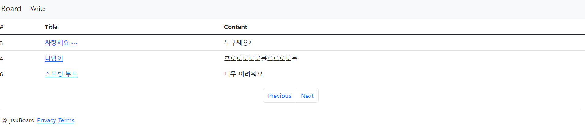

### 1. 페이징 기능 view 구현

- list.mustache_아래 코드를 추가

```html
<ul class="pagination justify-content-center">
   <li class="page-item"><a class="page-link" href="?page={{previous}}">Previous</a></li>
   <li class="page-item"><a class="page-link" href="?page={{next}}">Next</a></li>
</ul>
```

### 2. Controller에서 페이징 기능 구현

```java
@GetMapping("")
    public String listArticle(Model model, Pageable pageable){
        Page<Article> list = articleRepository.findAll(pageable);
        model.addAttribute("articles",list);
        model.addAttribute("previous",pageable.previousOrFirst().getPageNumber());
        model.addAttribute("next",pageable.next().getPageNumber());
        return "articles/list";
    }
```

- jpa에서 제공하는 Pageable 인터페이스 구현체를 사용한다.

## Docker 배포

### 1. jar 파일 만들기

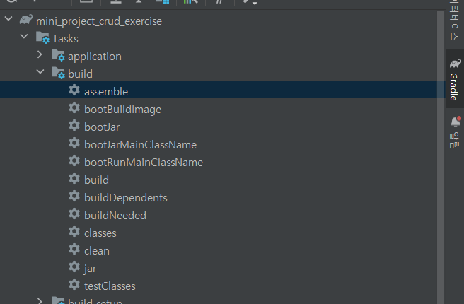

- 오른쪽 Gradle에 들어가서 build의 assemble을 클릭하면 .jar파일을 생성한다.
- jar파일
-

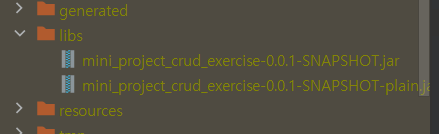

### 2. Dockerfile을 만들기

- 루트 디렉토리에 Dockerfile을 생성한다.

```java
FROM gradle:7.4-jdk11-alpine as builder
WORKDIR /build

# 그래들 파일이 변경되었을 때만 새롭게 의존패키지 다운로드 받게함.
COPY build.gradle settings.gradle /build/
RUN gradle build -x test --parallel --continue > /dev/null 2>&1 || true

# 빌더 이미지에서 애플리케이션 빌드
COPY . /build
RUN gradle build -x test --parallel

# APP
FROM openjdk:11.0-slim
WORKDIR /app

# 빌더 이미지에서 jar 파일만 복사
COPY --from=builder /build/build/libs/*-SNAPSHOT.jar ./app.jar

EXPOSE 8080

# root 대신 nobody 권한으로 실행
USER nobody
ENTRYPOINT [                                                \
   "java",                                                 \
   "-jar",                                                 \
   "-Djava.security.egd=file:/dev/./urandom",              \
   "-Dsun.net.inetaddr.ttl=0",                             \
   "app.jar"              \
]
```

### 3. git에 commit and push

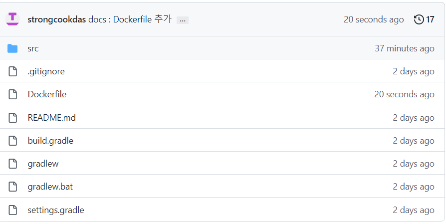

### 4. 서버에서 git clone


### 5. 프로젝트 디렉토리로 이동 후 docker 빌드

- `cd 프로젝트명`
- `docker build -t 프로젝트명 .` ← .꼭 추가해줘야 빌드가 된다.

### 6. 도커에서 .jar파일 실행

- `docker run -p 8080:8080 -e DB_HOST=jdbc:mysql://..... -e DB_USER=... -e DB_PASSWORD=... -d 생성된 도커 이미지 명`
- EC2 인스턴스 URL:포트번호/board 라고 웹 브라우저에 검색하면 서비스가 실행된다.
- [http://ec2-13-125-202-224.ap-northeast-2.compute.amazonaws.com:8080/board](http://ec2-13-125-202-224.ap-northeast-2.compute.amazonaws.com:8080/board)

## 프로젝트를 진행하면서 발생할 수 있는 문제

### DB 접속이 안되는 문제

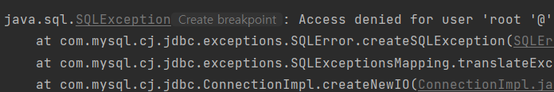

- 원인
    - 로그인 정보가 잘못된 경우 (환경변수 입력을 잘못한 경우)
    - DB 포트번호를 잘못 적은 경우
- 해결
    - DB설정을 다시 확인한다.
    - 참고 : [https://changun516.tistory.com/55](https://changun516.tistory.com/55)

### 생성자 오버로딩시 우선순위 문제

```java
@AllArgsConstructor
@NoArgsConstructor
@Setter
@Getter
public class ArticleDto {
```

- 원인
    - AllArgsConstructor와 NoArgsConstructor 둘다 추가할 경우 우선순위는 NoArgsConstructor다.
    - PostMaping시 데이터를 넘겨주기 위해 Dto 객체를 생성하려고 생성자를 부른다.
    - 우선순위로 NoArgsConstructor를 호출하고 값을 Setter로 Mapping하려고하는데 Setter를 추가하지 않는다면 아래와 같은 에러가 발생한다.
    - No key, method or field with name 'title' on line 14
    - null값이 들어간다.
- 해결
    - Setter를 추가해주면 된다.
    - 참고 : [https://steady-coding.tistory.com/489](https://steady-coding.tistory.com/489)

### 게시글 삭제 기능 구현시 삭제 메세지가 뜨지 않은 문제

```java
@GetMapping("/{id}/delete")
    public String deleteArticle(@PathVariable Long id, Model model){
        Optional<Article> optArticle = articleRepository.findById(id);
        if (optArticle.isEmpty())
            return "error";
        else {
            String msg = optArticle.get().getId()+"번째 게시글이 삭제됐습니다.";
            articleRepository.deleteById(optArticle.get().getId());
            model.addAttribute("msg",msg);
            return "redirect:/board";
        }
    }
```

- 원인
    - 삭제 메세지를 model.addattribute로 view로 전달하고 있다.
    - 하지만 해당 메소드의 반환 값으로 redirect를 사용해 view가 아닌 url을 반환하고 있다.
    - model은 view에 data를 넘길 때 사용하는 객체다.
- 해결
    - RedirectAttributes 클래스를 사용하면 된다.
    - RedirectAttributes는 redirect 시 데이터를 전달할 수 있는 객체이다.
    - post방식으로 데이터를 넘겨주는 `addFlashAttribute` 메서드를 사용해야한다.
- 참고 자료
- [https://iamdaeyun.tistory.com/entry/스프링-컨트롤러](https://iamdaeyun.tistory.com/entry/%EC%8A%A4%ED%94%84%EB%A7%81-%EC%BB%A8%ED%8A%B8%EB%A1%A4%EB%9F%AC)
- [https://mine-it-record.tistory.com/416](https://mine-it-record.tistory.com/416)

### 댓글 삭제 구현 시 에러

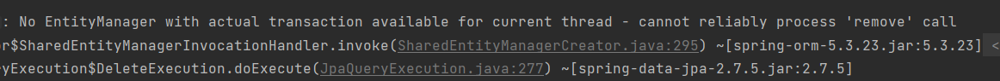

- 원인
    - CommentRepository에서 delelteAllByArticleId를 선언했을 때 Transactional 어노테이션을 붙이지 않아서 생긴 문제
    - 트랜잭션이란
        - 거래라는 의미로 DB에서 한 작업이 마무리되지 않으면 원상태로 돌아가는 것을 말한다.
        - 삭제에 실패를 하면 삭제 전으로 돌아간다.
        - delete를 선언할 때는 트랜잭션을 적용해야한다.
- 해결
    - @Transactional를 추가해준다.
- 참고
    - [https://yoonho-devlog.tistory.com/61](https://yoonho-devlog.tistory.com/61)

### 도커 빌드 시 용량 이슈


- 원인
    - aws 인스턴스의 용량이 부족
- 해결
    - `docker system df` : docker의 용량을 확인한다.
    - `docker image prune` : 사용하지 않는 image를 삭제한다.
    - `docker container prune` : 실행 중이지 않은 컨테이너들을 삭제할 수 있다.
    - `docker system prune -a` : 이미지, 컨테이너, 네트워크 등 한번에 삭제할 수 있다.
    - `docker volume prune` : 아래 명령어로 Volumes을 삭제한다.
- 참고
    - [https://engineer-mole.tistory.com/256](https://engineer-mole.tistory.com/256)